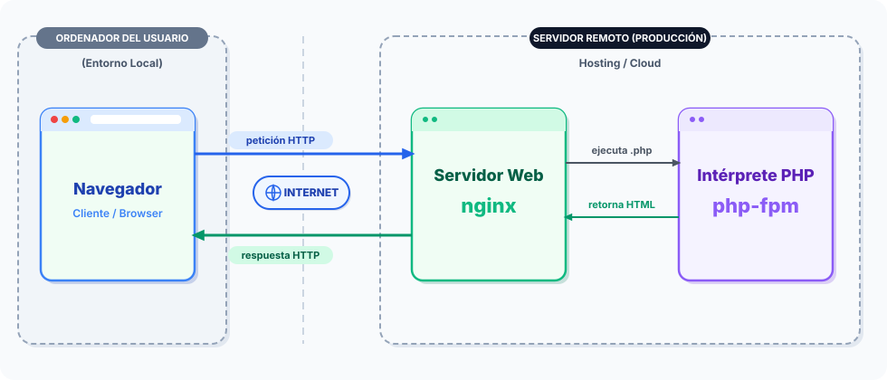
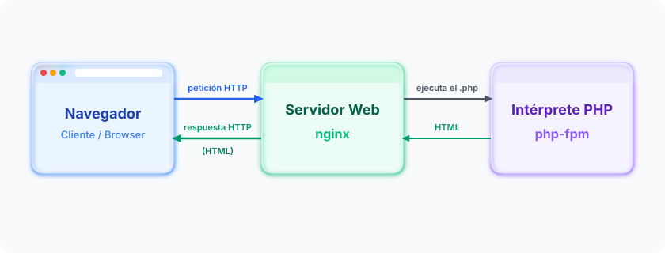

# 2.1. PHP embebido en HTML

> **Bloque 2 · Inserción de código en páginas web (RA2).** En este bloque construimos la **primera versión de _marcapersonalFP_ en PHP plano** (la llamaremos _v0_). Aquí no hay framework todavía: escribiremos PHP "a mano", embebido en HTML, para entender qué ocurre por debajo. Más adelante, en el Bloque 4, reconstruiremos lo mismo con _Laravel_ y comprobaremos que **el framework automatiza lo que aquí hacemos a mano**.

## De la página estática a la página dinámica

Hasta ahora, en otros módulos, habrás servido páginas **estáticas**: ficheros `.html` que el servidor web entrega tal cual, iguales para todos los visitantes. En el desarrollo _en entorno servidor_ generamos el HTML **dinámicamente**: el servidor **ejecuta código** en el momento de la petición y produce un HTML que puede cambiar según los datos, el usuario o el momento.

Ese código puede ir **embebido** dentro del propio documento HTML: escribimos HTML normal y, en los puntos donde necesitamos que "pase algo", insertamos fragmentos de código que el servidor ejecuta antes de enviar la respuesta al navegador. El navegador **nunca ve ese código**: solo recibe el HTML resultante.



Esta es la situación habitual **en producción**: el navegador y el servidor están en máquinas distintas, y la petición y la respuesta viajan por Internet. En nuestra máquina virtual, sin embargo, **todos los componentes conviven en el mismo equipo** —navegador, `nginx` y `php-fpm`—. Esto simplifica mucho la instalación, pero tiene una contrapartida: al no haber una red real de por medio, es fácil olvidar que **sigue habiendo una petición y una respuesta HTTP igual de reales que en producción** — solo que ahora ese "viaje" ocurre entre programas de la misma máquina, no entre dos máquinas distintas.

Así queda ese mismo flujo en nuestro entorno de desarrollo:



**Idea clave:** el cliente recibe HTML; el código se queda y se ejecuta en el servidor — y esto no cambia por el hecho de que, en desarrollo, cliente y servidor compartan máquina.

## Tecnologías asociadas

La técnica de embeber código en HTML no es exclusiva de un lenguaje. Las tecnologías más habituales que permiten generar páginas en el servidor son:

- **PHP** — el lenguaje que usaremos en este módulo. Diseñado desde el principio para embeberse en HTML.
- **ASP / ASP.NET** — tecnología de Microsoft.
- **JSP** (_JavaServer Pages_) — sobre la plataforma Java.
- **Python** — mediante servlets, WSGI o frameworks como Django/Flask.
- **JavaScript (Node.js)** — en el lado servidor, normalmente con un framework como **Express**; el equivalente al "código embebido" son motores de plantillas como **EJS** (`<% %>`, muy similar a `<?php ?>`) o **Handlebars**.

Todas comparten la misma idea (código que el servidor ejecuta para producir el marcado que verá el cliente); cambian la sintaxis y el ecosistema. Nosotros trabajaremos con **PHP** por ser el más extendido en la web y la base sobre la que se construye _Laravel_.

## Las etiquetas `<?php ?>`

En un fichero `.php`, todo lo que escribas se envía al navegador **tal cual**, como si fuera HTML, **excepto** lo que quede encerrado entre las etiquetas de apertura y cierre de PHP:

```php
<?php
  // Esto es código PHP: el servidor lo ejecuta, el navegador no lo ve.
?>
```

- `<?php` — **abre** una zona de código PHP.
- `?>` — **cierra** la zona de código y vuelve al modo HTML.

Fíjate en cómo se combinan HTML y PHP en el mismo documento:

```php
<!DOCTYPE html>
<html lang="es">
<head>
    <meta charset="UTF-8">
    <title>marcapersonalFP v0</title>
</head>
<body>
    <h1>Hola, marcapersonalFP</h1>
    <p>Esta página se ha generado el <?php echo date('d/m/Y H:i:s'); ?>.</p>
</body>
</html>
```

Todo el HTML se envía sin cambios; solo el fragmento `<?php echo date(...); ?>` se **ejecuta en el servidor** y se sustituye por su resultado (la fecha y hora actuales). Si recargas la página, la hora cambia: eso es una página **dinámica**.

> **Nota.** Cuando un fichero contiene **solo** código PHP (sin HTML alrededor, como veremos en las clases del proyecto), la convención es **omitir la etiqueta de cierre `?>`** al final del archivo, para evitar problemas con espacios en blanco accidentales. En ficheros que mezclan HTML y PHP, en cambio, sí abriremos y cerraremos cada fragmento.

## Preparación del entorno de trabajo

Durante **todo el curso** usaremos el mismo entorno: la **máquina virtual con _Laradock_** (Docker + _nginx_ + _php-fpm_) que se facilita con el REA. Trabajar siempre en el mismo sitio nos ahorra sorpresas: lo que aquí escribimos en PHP plano convivirá, en el Bloque 4, con el proyecto _Laravel_ en el mismo servidor.

> Si no te han facilitado la máquina virtual con la configuración necesaria para seguir este REA, sigue antes [0. Instalación y preparación del entorno](./00_instalacionEntorno.md). Aquí asumimos que Laradock ya está instalado.

Recuerda cómo colaboran los dos contenedores implicados:

- **`nginx`** es la **puerta HTTP** (puerto 80): es a quien apunta el navegador.
- **`php-fpm`** es el **motor** que ejecuta el PHP (habla FastCGI por el puerto 9000, **no** HTTP).

Por eso necesitamos **los dos** levantados. Como en _Laradock_ `nginx` depende de `php-fpm`, basta con este comando **desde la carpeta `laradock/`**:

```bash
docker compose up -d nginx php-fpm
```

Nuestro proyecto de estos bloques se llama **`vanilla_php`** (ya viene creado en la VM, en `~/Documentos/laravel/vanilla_php/`, junto a la carpeta `laradock/`): se llama así porque aquí escribimos PHP **"vanilla"** — el lenguaje puro, tal cual lo procesa el intérprete, sin ningún _framework_ de por medio — en contraste con el **"con framework"** que llegará en el Bloque 4 con _Laravel_, donde buena parte de este trabajo se automatiza.

> A partir de aquí, cada vez que en este bloque veas una ruta como `vanilla_php/public/...`, se entiende relativa a `~/Documentos/laravel/` — la carpeta de trabajo de la VM donde vive tanto `laradock/` como cada proyecto del curso.

_nginx_ sirve como raíz web (_docroot_) la carpeta **`vanilla_php/public/`** (en el contenedor, `/var/www/vanilla_php/public`). Así que nuestros scripts de este bloque van ahí:

1. Guarda tu primer script como **`vanilla_php/public/RA2_holaMundo.php`** con el ejemplo HTML+PHP de arriba.
2. Abre en el navegador: **`http://localhost/RA2_holaMundo.php`**

Deberías ver el HTML con la fecha generada por el servidor.

> **Avisos prácticos**
> - Navega al **fichero concreto** (`/RA2_holaMundo.php`). Si abres `http://localhost/` a secas y no hay un `index.php`, obtendrás un error 404.
> - Si el puerto 80 estuviera ocupado, en el fichero `.env` de _Laradock_ puedes cambiar `NGINX_HOST_HTTP_PORT` (por ejemplo a `8080`) y entonces la dirección sería `http://localhost:8080/RA2_holaMundo.php`.

## Comprueba que el código vive en el servidor

Con la página abierta en el navegador, usa **"Ver código fuente de la página"** (`Ctrl+U`). Observa que **no aparece** ninguna etiqueta `<?php ?>`: solo ves el HTML final, con la fecha ya sustituida. Esa es la prueba de que PHP se ejecutó **en el servidor** y el cliente recibió únicamente el resultado. Compáralo con lo que escribiste en `vanilla_php/public/RA2_holaMundo.php`: ahí sí está el código.

## Ejercicios

1. **Primer script.** Crea `vanilla_php/public/RA2_holaMundo.php` con el ejemplo de esta sección, levanta el entorno y visualízalo en el navegador. Recarga varias veces y comprueba que la hora cambia.
2. **Fuente vs. resultado.** Abre "Ver código fuente" (`Ctrl+U`) y confirma que no hay etiquetas PHP. Anota en un comentario del fichero qué diferencia hay entre lo que escribes y lo que recibe el navegador.
3. **Mezcla HTML/PHP.** Añade un segundo párrafo que muestre, con `echo`, el nombre del centro (`marcapersonalFP`) y el año actual (`date('Y')`) dentro de una frase de bienvenida.
4. **Investiga.** De las tecnologías asociadas (ASP, JSP, Python, JavaScript/Node.js), elige una y escribe dos líneas en un comentario del script explicando en qué se parece y en qué se diferencia de PHP en cuanto a "código embebido".

## Comprueba tu solución automáticamente (opcional)

Junto a cada ejercicio del bloque encontrarás un test que puedes ejecutar para saber, al instante, si tu solución es correcta — sin esperar a que el profesor la revise. No hace falta entender cómo está escrito el test (eso lo veremos como contenido en el Bloque 7, con TDD); de momento solo lo **ejecutas** y lees el resultado. La preparación (`vanilla_php/composer.json`, `phpunit.xml`, PHPUnit instalado) ya viene hecha en la máquina virtual — ver la sección *Proyecto `vanilla_php` y PHPUnit* de [0. Instalación y preparación del entorno](./00_instalacionEntorno.md).

Para el ejercicio 1 (*Primer script*), copia el archivo [RA2_1_HolaMundoTest.php](./materiales/ejercicios-vanilla/tests/RA2_1_HolaMundoTest.php) a la carpeta `vanilla_php/tests/` de tu proyecto y ejecuta, desde un terminal situado en la carpeta `laradock/`, ese fichero de test en concreto:

```bash
docker compose exec --workdir /var/www/vanilla_php workspace vendor/bin/phpunit tests/RA2_1_HolaMundoTest.php
```

Si todo está bien: `OK (2 tests, 4 assertions)`. Si algo falla, PHPUnit te dice **cuál** de las dos comprobaciones no pasa y por qué.

---

**Siguiente:** [2.2. Sintaxis, sentencias y salida (`echo`/`print`)](./RA2_2_sintaxisSalida.md)
